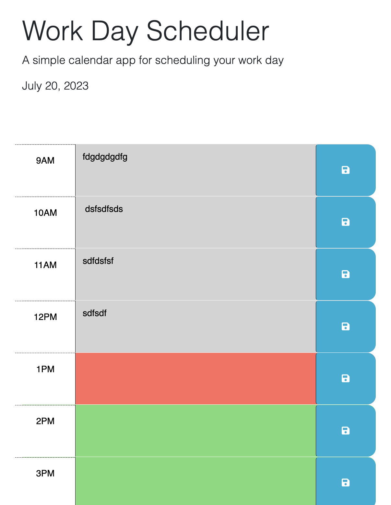

# Scheduler/Calendar App - Module 5 
## Description

This is the module 5 challenge. In this challenge, I modified a scheduler. A user of this scheduler app can schedule their day using hour slots. The past hour is gray in color, the current hour is tomato red, and future time slots are green.

## Live URL

Live URL Link: https://phillipkujawa.github.io/philscheduler-module5/

## Contributor

* @phillipkujawa

## License

MIT License
